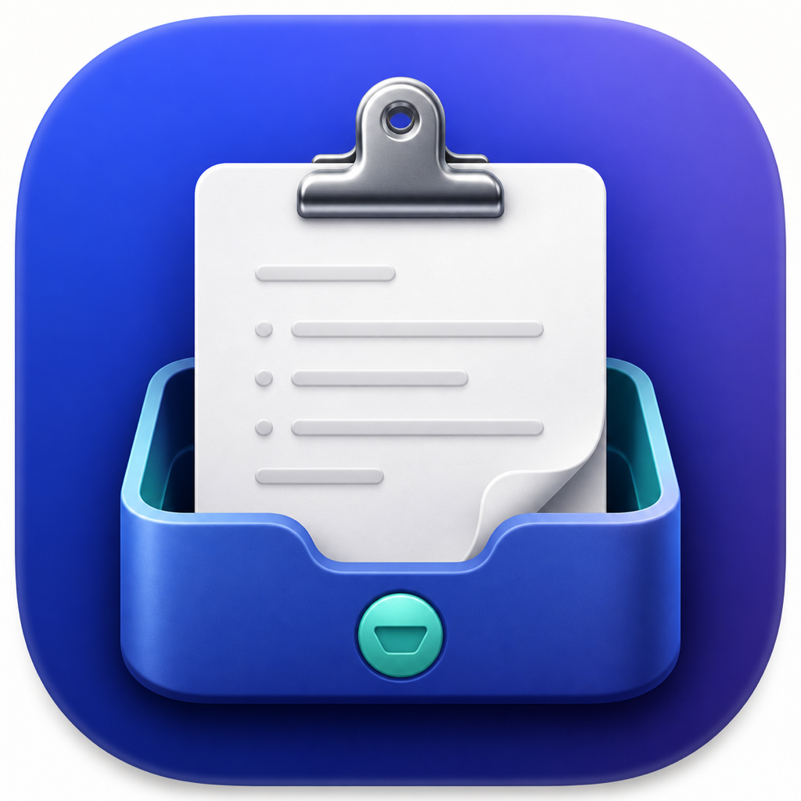

# ClipStow

> Capture now. Organize later.

<p align="center">
  
</p>

[](https://github.com/parkcom/clipstow/actions/workflows/ci.yml)
[](LICENSE)
[](https://www.apple.com/macos/)

ClipStow is a native macOS menu bar app for quickly capturing Markdown notes and temporarily collecting copied text. Notes stay on your Mac as local JSON; unsaved Scratchpad items stay in memory and disappear when the app quits.

[한국어 문서](docs/README.ko.md)

## Features

- Open from the menu bar or a customizable global shortcut (`⌥ Space` by default).
- Organize notes with collapsible categories and a compact note list.
- Edit Markdown and preview headings, emphasis, lists, task lists, code, and links.
- Collect copied text in an in-memory Scratchpad without intercepting `⌘C`.
- Turn one or all Scratchpad items into persistent notes.
- Browse a user-selected folder, sort files by name, modified date, or size, preview them with Quick Look, and drag them into other apps as attachments.
- Resize or pin the popover and adjust UI, note, and Scratchpad font sizes.
- Launch at login and switch the interface between English, Korean, and Japanese.
- Prevent multiple app instances from running simultaneously.

## Download and install

1. Download the latest `ClipStow-*.dmg` from [GitHub Releases](https://github.com/parkcom/clipstow/releases/latest).
2. Open the DMG and drag **ClipStow** into **Applications**.
3. Launch ClipStow from Applications. It appears in the menu bar rather than the Dock.

Release downloads are signed with a Developer ID certificate and notarized by Apple. ClipStow requires macOS 13 Ventura or later and supports both Apple Silicon and Intel Macs.

ClipStow does not update itself yet. Install a newer release from the same Releases page when one becomes available.

## Build from source

Building from source requires Xcode 26 or later.

```sh
git clone https://github.com/parkcom/clipstow.git
cd clipstow
open ClipStow.xcodeproj
```

In Xcode, select the `ClipStow` scheme and the `My Mac` destination, then run the app. ClipStow appears in the menu bar rather than the Dock.

Command-line checks:

```sh
xcodebuild -project ClipStow.xcodeproj \
  -scheme ClipStow \
  -destination 'platform=macOS' \
  test

xcodebuild -project ClipStow.xcodeproj \
  -scheme ClipStow \
  -destination 'platform=macOS' \
  -configuration Debug \
  build
```

Swift Package Manager dependencies are locked in `Package.resolved`:

- [KeyboardShortcuts 3.0.1](https://github.com/sindresorhus/KeyboardShortcuts)
- [MarkdownUI 2.1.0](https://github.com/gonzalezreal/swift-markdown-ui)

## Quick usage

1. Open ClipStow from its menu bar icon or global shortcut.
2. Create a note from the note-list toolbar.
3. Double-click a note title in the list to rename it.
4. Use **Edit** for Markdown source and **Preview** for rendered output.
5. Open **Scratchpad**, enable **Copy Capture**, and copy text in another app.
6. Copy individual items to notes, or save all items as one note.
7. Open **Folder**, select a folder, and click a column header to sort in either direction. Select or double-click files to preview them, or drag a file row into another app to attach it.

Settings include the app language, global shortcut, launch at login, popover pinning, and font sizes. If a shortcut conflicts with another app or a system shortcut, ClipStow shows a warning; the menu bar icon remains available.

## Storage and privacy

Persistent notes are atomically written to `ClipStow/store.json` under the app sandbox's Application Support directory. A typical path is:

```text
~/Library/Containers/com.parkcom.clipstow/Data/Library/Application Support/ClipStow/store.json
```

Scratchpad text is not written to disk. Folder access is read-only and limited to the folder the user selects; a security-scoped bookmark is stored so access can be restored after relaunch. ClipStow has no accounts, analytics, telemetry, cloud sync, or application-level network requests. See [PRIVACY.md](PRIVACY.md) for details.

Copy Capture checks `NSPasteboard.changeCount` every 250 ms and only reads text after it changes. It does not monitor keyboard events or replace the normal copy operation. macOS may ask for Pasteboard access; if access is denied, enable it again in System Settings.

## Known limitations

- Clipboard values overwritten between two polling intervals cannot be recovered.
- Search, attachments stored inside notes, tags, sync, sharing, version history, and deletion recovery are not included.
- Categories and their notes are permanently removed after confirmation.
- Unsaved Scratchpad content disappears when ClipStow quits.
- Automatic updates are not included; install new versions from GitHub Releases.

## Contributing and support

Bug reports and focused improvements are welcome. Read [CONTRIBUTING.md](CONTRIBUTING.md) before opening a pull request. For help, use [GitHub Issues](https://github.com/parkcom/clipstow/issues); for sensitive vulnerabilities, follow [SECURITY.md](SECURITY.md).

## License

ClipStow is available under the [MIT License](LICENSE).
